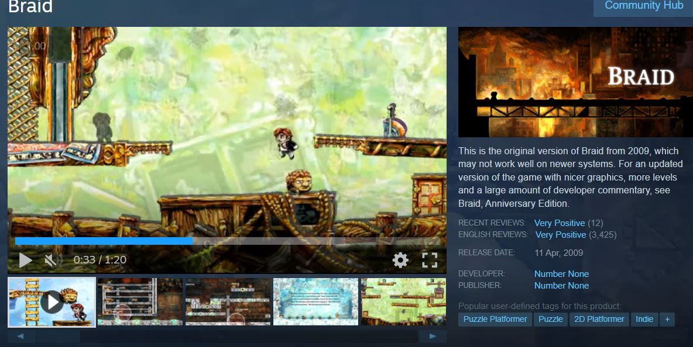
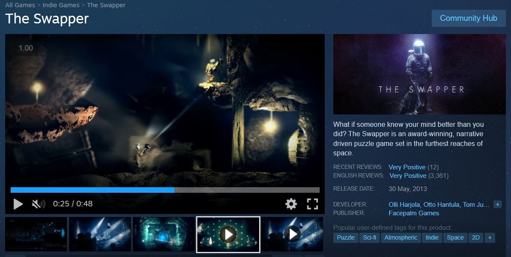
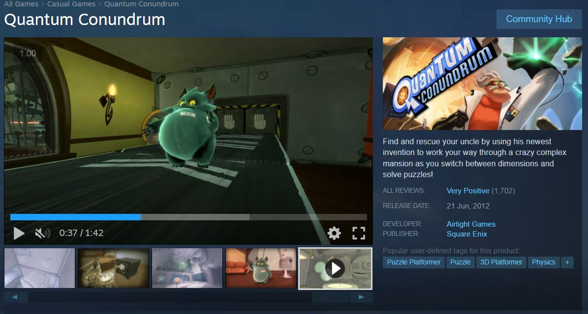

# כותרת ראשית: Thought Loop - לולאת המחשבה

**tagline: שכפל את עצמך בזמן כדי לפתור חידות בעזרת גרסאות העבר שלך**

## מהות המשחק

אתה מגלם רובוט קטן במתקן ניסויים שבו הזמן חוזר על עצמו כל כמה שניות. בכל לולאת זמן, שכפול-רוח-רפאים של הפעולות הקודמות שלך משחזר בדיוק את מה שעשית, בעוד אתה שולט בעצמך ה"נוכחי". עליך לתאם פעולות עם העצם הקום שלך כדי ללחוץ על מתגים, לפתוח דלתות ולהגיע לפלטפורמות. המשחק משלב חשיבה אסטרטגית עם פעולה מדויקת.

המשחק מיועד למחשב רגיל (PC) עם פקדי מקלדת ועכבר, ובעתיד אפשר להרחיב לפלטפורמות נוספות.

*תמונה: רובוט במתקן ניסויים עם שכפול שלו פועלים יחד*

---

## רכיבים רשמיים

### 1. שחקנים

* **קהל יעד**: המשחק מיועד לשחקנים בגילאי 12+, חובבי משחקי פאזל ופלטפורמר שאוהבים אתגרים לוגיים. מתאים למי שאוהב משחקים כמו Portal, Braid או The Witness. דורש חשיבה מראש ותכנון, אבל לא דורש כישורי פעולה מהירים במיוחד.

* **מספר שחקנים**: שחקן יחיד (Single Player)

* **דפוסי אינטראקציה**: אין אינטראקציה בין שחקנים - זהו משחק סולו שבו השחקן מתמודד עם חידות ומכשולים של המערכת.

### 2. יעדים

**יעדי המשחק:**
* יעד מיידי: להגיע ליציאה של כל חדר/שלב תוך שימוש בלולאות הזמן
* יעדי משנה: לפתור חידות באמצעות תיאום מתגים, העברת חפצים בין לולאות, והתחמקות ממכשולים
* יעד כולל: להשלים את כל חדרי הניסוי ולגלות את סיפור הרקע של המתקן

**הודעת יעדים לשחקן:**
* בתחילת כל שלב תופיע הודעה קצרה על המסך המסבירה את המשימה ("הגע ליציאה", "הפעל את שני המתגים")
* סימון ויזואלי ברור של היציאה/היעד בכל חדר
* מערכת רמזים עדינה שמתגלה אם השחקן תקוע (אחרי מספר ניסיונות)

### 3. תהליכים

**תהליך ההתחלה - 30 השניות הראשונות:**

השחקן מתעורר כרובוט קטן בחדר פשוט. הודעה על המסך: "השתמש בחיצים כדי לזוז, רווח לקפיצה". החדר הראשון פשוט מאוד - רק צריך ללכת ימינה ולקפוץ על פלטפורמה קטנה להגיע ליציאה. לאחר יציאה, טיימר מופיע (10 שניות) והזמן מתחיל לרוץ. הזמן מתאפס, שכפול של השחקן מופיע ועושה בדיוק את מה שעשה לפני רגע. השחקן מבין את המכניקה באופן אינטואיטיבי ועובר לחדר השני שדורש כבר שיתוף פעולה עם העצם הקודם.

**תהליך הליבה - רצף פעולות חוזר:**

השחקן בוחן את החדר ומזהה את החידה (איפה המתגים, מה צריך לעשות). הוא מתכנן את הלולאה הראשונה - איזה פעולה לבצע ב-10 שניות. מבצע את הלולאה הראשונה בעזרת תנועה עם החיצים, קפיצה עם רווח. הזמן מתאפס - שכפול מופיע ומשחזר את הפעולות. השחקן מתכנן את הלולאה השנייה תוך תיאום עם השכפול הראשון, וחוזר על התהליך עד פתרון החידה (בדרך כלל 2-4 לולאות). לבסוף מגיע ליציאה ועובר לשלב הבא.

**תהליך הסיום:**

השחקן מגיע לחדר האחרון - חידה מורכבת במיוחד שדורשת 5-6 לולאות מתואמות. פתרון החידה מוביל לחדר בקרה מרכזי. לחיצה על כפתור האדום הגדול מפעילה קטע סיום שמגלה את הסיפור. מסך סיכום מציג סטטיסטיקות: זמן משחק כולל, מספר לולאות ששימשו, רמות שהושלמו. השחקן יכול לחזור ולשפר ביצועים ברמות ספציפיות.

**למידת התהליכים:**

Tutorial אינטגרטיבי - השלבים הראשונים מלמדים באופן טבעי. הודעות קצרות על המסך כשנתקלים במכניקה חדשה. התקדמות הדרגתית במורכבות - כל שלב מוסיף מעט מורכבות.

### 4. חוקים

**חוקים מגבילים:**
* השחקן יכול לזוז רק בזמן שהטיימר פועל (10 שניות)
* כשהזמן מסתיים, השחקן מתקפא ושכפול מופיע
* השכפולים לא ניתנים לשליטה - הם רק משחזרים פעולות קודמות
* אסור לשכפול ול"עצמי הנוכחי" לנגוע זה בזה (גורם לכשל ולאיפוס הלולאה)
* מספר הלולאות בכל שלב מוגבל (למשל, מקסימום 5 שכפולים)
* מתגים דורשים לחץ מתמשך - אם אף אחד לא עומד עליהם, הם משתחררים

**חוקי תוצאות:**
* לחיצה על מתג פותחת דלת/מפעילה פלטפורמה כל עוד לוחצים עליו
* נפילה מגובה רב מדי גורמת לאיפוס הלולאה
* הגעה ליציאה עם כל המתגים פעילים = ניצחון בשלב
* נגיעה במלכודת או באויב = איפוס
* העברת חפץ בין לולאות: שכפול שזורק חפץ יכול להשאיר אותו לעצמי הנוכחי

**למידת החוקים:**

Tutorial מובנה בשלבים הראשונים. Visual feedback ברור (מתג נדלק באדום כשפעיל, דלת נפתחת עם אנימציה). הודעות שגיאה ידידותיות ("שכפולים לא יכולים לנגוע זה בזה!"). אפשרות לראות הדגמה של פתרון אפשרי אם השחקן תקוע.

### 5. משאבים

**סוגי משאבים:**
* **זמן**: כל לולאה היא 10 שניות - המשאב הקריטי ביותר
* **שכפולים זמינים**: מספר הלולאות המקסימלי בכל שלב (מוגבל)ה
* **תכונות מיוחדות**: ניתן לפתוח (Dash, Slow Motion, Double Jump) במהלך ההתקדמות

**תועלת המשאבים:**
* זמן מאפשר לבצע יותר פעולות בכל לולאה
* שכפולים מאפשרים פתרון חידות מורכבות יותר
* תכונות פותחות דרכים חדשות לפתור חידות

**השגת משאבים:**
* זמן מתארך אוטומטית ב-2 שניות כל 3 שלבים שמושלמים
* שכפולים: כל שלב מתחיל עם מכסה קבועה (2-6 לולאות לפי רמת הקושי)
* תכונות נפתחות אוטומטית אחרי השלמת שלבי מפתח

**יצירת נדירות:**

זמן מוגבל ולא מתחדש בתוך שלב. מספר שכפולים מוגבל - צריך להשתמש בהם בחוכמה. תכונות חזקות דורשות התקדמות משמעותית.

**הצגת מידע לשחקן:**

טיימר גדול על המסך מציג את הזמן שנותר בלולאה. מונה שכפולים בפינת המסך ("3/5 Clones Used"). אייקונים של תכונות זמינות בתחתית המסך עם מקשי קיצור.

### 6. עימותים

**עימות עם המערכת (מכשולים):**
* פיזיקליים: בורות, קוצים, פלטפורמות נעות, לייזרים
* זמניים: צריך להגיע למתג לפני שהדלת נסגרת
* לוגיים: מתגים שצריכים לחיצה סימולטנית, רצפים מורכבים
* אויבים פשוטים: רובוטי שמירה בשלבים מתקדמים (ניתן להסיח אותם עם שכפולים)

**עימות בין שחקנים:**

אין - המשחק הוא single player

**עימות פנימי (דילמות):**
* תכנון לעומת אימפרוביזציה: האם לתכנן את כל הלולאות מראש או לנסות ולטעות?
* מהירות מול דיוק: האם להשתמש במהירות או להאט זמן?
* פרפקציוניזם: האם להשלים שלב במינימום לולאות (אתגר) או פשוט להתקדם?
* ניסוי וטעייה מול חשיבה: האם לנסות מיד או לחשוב קודם?

### 7. גבולות

**סוג עולם:**
* **סגור**: כל שלב הוא חדר סגור עם גבולות ברורים
* **שטוח**: המשחק הוא 2D side-scroller, עם תנועה שמאל-ימין ומעלה-מטה

**הצגת גבולות:**

קירות ותקרות ברורים ויזואלית (מבנה מתכתי של מתקן). אם השחקן מנסה לצאת מהמסך - נתקל בקיר בלתי נראה. המצלמה ממוקמת כך שרואים את כל החדר או רובו. מפה מיני בפינת המסך מראה את המבנה הכולל של השלב.

**עקרונות תיכנון המפה:**
* **משמעות**: כל אלמנט בשלב (מתג, פלטפורמה, מכשול) קיים מסיבה - תורם לפתרון החידה
* **ניידות**: השחקן יכול לנוע בחופשיות בתוך המרחב המוגדר, עם מכניקות ברורות (ריצה, קפיצה)
* **התמצאות**: השלבים ברורים ולא מבלבלים - אפשר לזהות מהר איפה היציאה, המתגים והמכשולים
* **עניין**: כל שלב מציג אתגר חדש או וריאציה על מכניקות קיימות - לא משעמם
* **הכוונה**: Visual cues (כמו חצים, צבעים, תאורה) מכוונים את השחקן לאן ללכת ומה חשוב

### 8. תוצאות

**תוצאות אפשריות:**
* **ניצחון מלא**: השלמת כל השלבים בזמן אופטימלי (3 כוכבים)
* **ניצחון רגיל**: השלמת כל השלבים ללא אופטימיזציה (1-2 כוכבים)
* **ניצחון חלקי**: השלמת חלק מהשלבים (יכול לחזור לשלבים שדולג עליהם)
* **אי-השלמה**: השחקן לא מצליח לעבור שלב ונתקע (יכול לנסות שוב ללא הגבלה)

**תלות במזל מול כישרון:**
* 95% כישרון: המשחק דורש תכנון, לוגיקה, זמון מדויק
* 5% מזל: אולי בחלק קטן מהשלבים עם פלטפורמות נעות, אבל גם זה לא באמת מזל אלא timing
* המשחק הוא deterministic - אותו input תמיד ייתן אותה תוצאה

**סוג משחק:**
* לא סכום אפס: אין מתחרים, כל שחקן משחק נגד המערכת
* לא שיתופי: single player בלבד
* משחק של חשיבה ואתגר אישי: השחקן מתחרה עם עצמו לשיפור ביצועים

---

## סקירת משחקים קיימים

**ביטויי חיפוש ששימשו:**
* "time loop puzzle platformer"
* "clone yourself puzzle game"
* "time rewind mechanic games"
* "braid-like puzzle games"
* "cooperative with yourself puzzle"

### משחק דומה 1: Braid

**קישור**: https://store.steampowered.com/app/26800/Braid/

**תיאור הדמיון**:
Braid הוא משחק פאזל-פלטפורמר קלאסי שבו מכניקת ההחזרה בזמן היא המרכזית. השחקן יכול להחזיר זמן לאחור ולתקן טעויות, ולפתור חידות שדורשות מניפולציה של זמן.

**איך Thought Loop יהיה שונה ומקורי?**
* **מכניקה שונה**: ב-Braid אתה מחזיר זמן לאחור ושולט ב"עצמך בעבר", בעוד ב-Thought Loop אתה יוצר שכפולים עצמאיים שפועלים במקביל - זה יותר "שיבוט" ופחות "החזרה"
* **פוקוס על תיאום**: Thought Loop מדגיש תיאום בין מספר גרסאות של עצמך שפועלות בו-זמנית, לא רק תיקון טעויות
* **סגנון ויזואלי**: Thought Loop יהיה עם אסתטיקה מדעית-פנטסטית (sci-fi lab) במקום האומנות המצוירת של Braid
* **פשטות**: Braid מורכב מאוד פילוסופית ומכני - Thought Loop יהיה נגיש יותר

---

### משחק דומה 2: The Swapper

**קישור**: https://store.steampowered.com/app/231160/The_Swapper/

**תיאור הדמיון**:
משחק פאזל-פלטפורמר שבו אתה יוצר שכפולים של עצמך ויכול להחליף בינם את השליטה. השכפולים עוקבים אחרי הפעולות שלך בזמן אמת (mirroring).

**איך Thought Loop יהיה שונה?**
* **מכניקת זמן**: ב-Thought Loop השכפולים פועלים על ציר הזמן (משחזרים פעולות קודמות) ולא בזמן אמת כמו ב-Swapper
* **אין החלפת שליטה**: ב-Thought Loop אתה תמיד שולט ב"עצמך הנוכחי", לא עובר בין שכפולים
* **לולאות קצרות**: המגבלה של 10 שניות ליצירת לולאה מוסיפה לחץ ואתגר שלא קיים ב-Swapper
* **אווירה**: Thought Loop יהיה יותר sterile ו-test-chamber oriented (כמו Portal) ופחות אפל

---

### משחק דומה 3: Quantum Conundrum

**קישור**: https://store.steampowered.com/app/200010/Quantum_Conundrum/

**תיאור הדמיון**:
פאזל-פלטפורמר first-person שבו אתה במתקן ניסויים ופותר חידות עם מכניקות משתנות מציאות. האווירה והמבנה דומים מאוד (test chambers, AI narrator).

**איך Thought Loop יהיה שונה?**
* **דו מימד (2D) ולא תלת מימד (3D) יותר נגיש ופחות מסובך גם לפיתוח, יותר מפת side-scroller
* **מכניקה ייחודית**: Quantum Conundrum משחק עם gravity וממדים, לא עם זמן ושכפולים
* **פוקוס על תיאום עצמי**: המכניקה של "שיתוף פעולה עם עצמך" ייחודית ל-Thought Loop
* **סגנון משחק**: פחות הומוריסטי וקרטוני, יותר מינימליסטי ומסתורי

---

**הרכיב הרשמי שידגיש את הייחוד:**

**תהליכים** ו**חוקים** - המכניקה הייחודית של לולאות זמן קצרות עם שכפולים שפועלים במקביל היא לב המשחק. זה מה שמבדיל אותו מכל המתחרים:
* לא זו החזרת זמן פשוטה (Braid)
* לא שכפולים שמשכפלים בזמן אמת (Swapper)
* לא משחק עם מציאות אלטרנטיבית (Quantum Conundrum)

אלא **תיאום עצמי על ציר זמן במקביל** - זה המינוף הקריאטיבי והייחודי שיגרום לשחקנים לבחור ב-Thought Loop.

