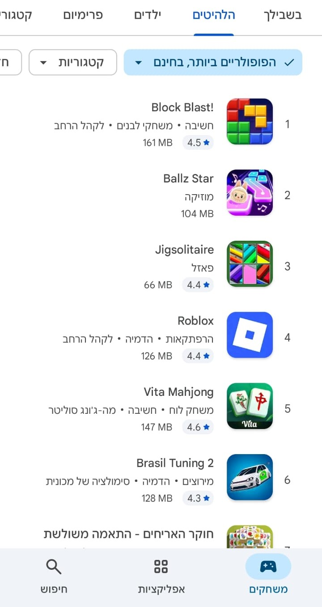
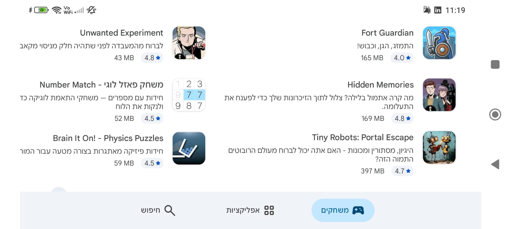
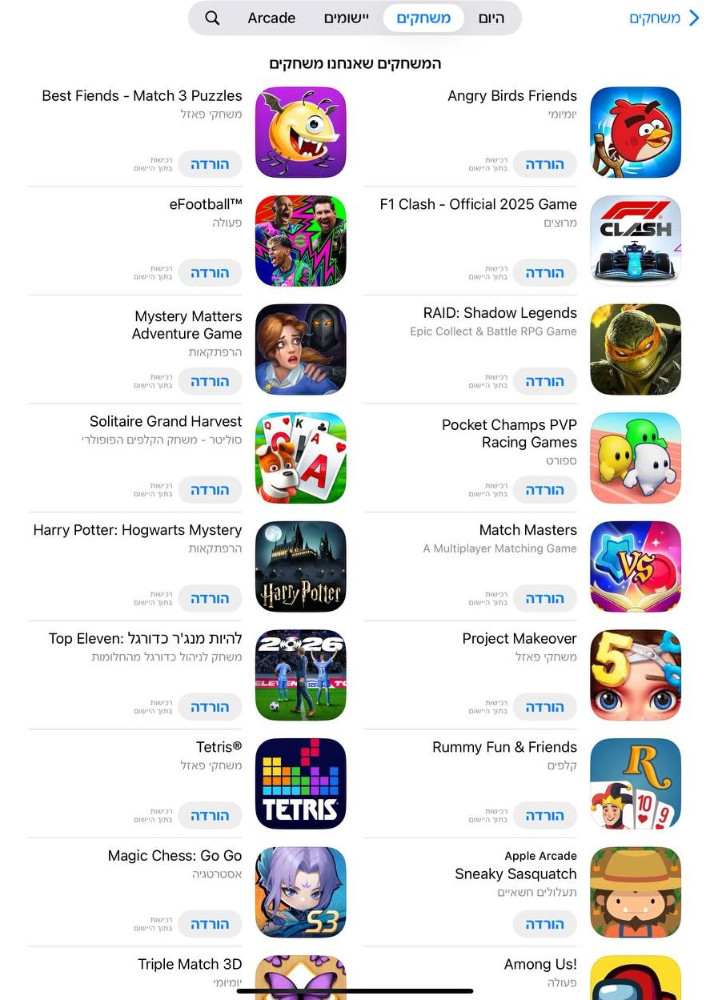
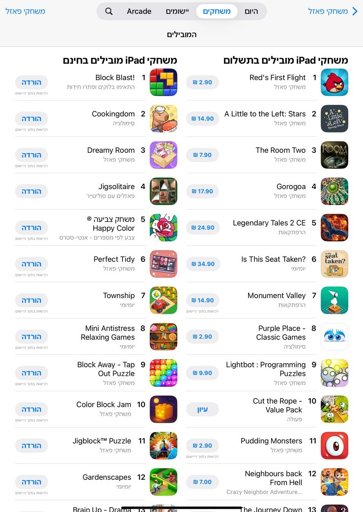
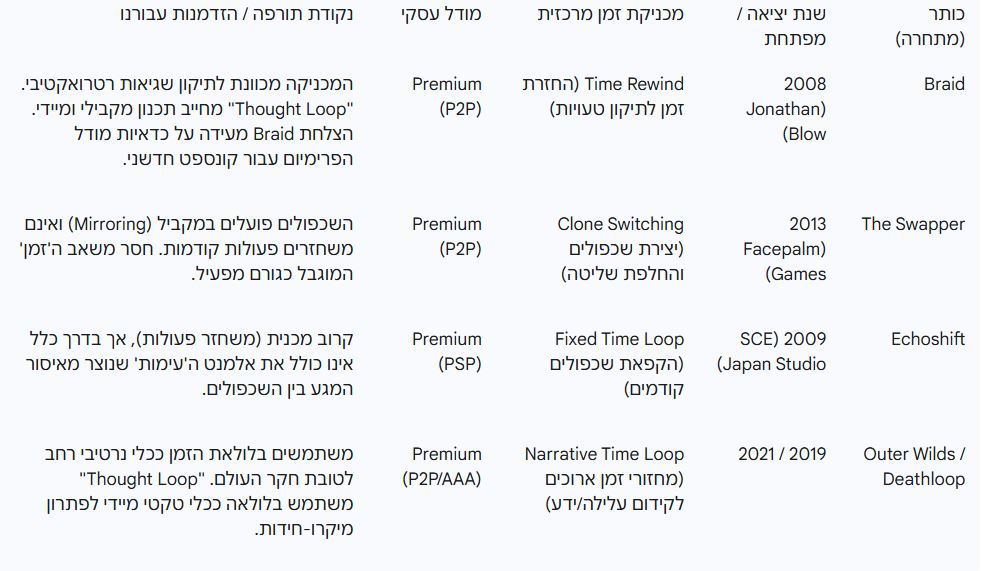

# סקר שוק - Thought Loop (לולאת המחשבה)

**שכפל את עצמך בזמן כדי לפתור חידות בעזרת גרסאות העבר שלך**
---

## 1. סקירת שוק וטרנדים

### מצב שוק משחקי הפאזל העולמי

שוק משחקי הפאזל העולמי נמצא בצמיחה יציבה ומרשימה:

- **גודל השוק**: כ-**1.776 מיליארד דולר** ב-2025
- **צמיחה שנתית**: **8.7% CAGR** (צמיחה שנתית ממוצעת)
- **תחזית**: המשך צמיחה עד 2033

הגורמים המרכזיים לצמיחה כוללים:
- פריצת טכנולוגיות ניידות (מסכים חזקים, מעבדי גרפיקה משופרים)
- פופולריות הגיימינג המזדמן (Casual Gaming)
- חדשנות במכניקות משחק וחוויות אינטראקטיביות

### שוק משחקי המחשב והאינדי

מגמה חזקה ב-2025 לטובת **"משחקים קצרים יותר, מלוטשים לשחקן יחיד"**:
- שחקנים מחפשים חוויות ממוקדות ואיכותיות
- צוותי פיתוח קטנים יותר עם סיכון נמוך יותר
- התמקדות באיכות הליבה של המשחקיות

**שוק האינדי הגלובלי**:
- צומח ב-**14.54% CAGR** לקראת 2030
- הצלחת כותרים כמו Braid ($6M הכנסות) מוכיחה שיש ביקוש למשחקי פרימיום איכותיים

### השוק הישראלי

- הכנסות חברות הפיתוח הישראליות הגיעו ל-**9 מיליארד דולר** ב-2022
- צמיחה שנתית של **54%** בשנים האחרונות
- **פאזלים הם אחד משלושת הז'אנרים המובילים** בהורדות ב-Google Play בישראל

### טרנדים מרכזיים בז'אנר

1. **דומיננטיות מובייל**: רוב ההכנסות בז'אנר הפאזל מגיעות ממשחקי מובייל (F2P)
2. **משחקים פשוטים מנצחים**: משחקים עם מכניקות פשוטות ונגישות (ללא צורך בחומרה חזקה) תופסים יותר
3. **Rewards ו-Engagement**: שימוש במערכות תגמול, פרסומות, ותזכורות כדי לשמר שחקנים
4. **מעבר לקז'ואל**: קהל רחב מחפש משחקים להעברת זמן, לא בהכרח משחקים מורכבים

---

## 2. קהלי יעד

### קהל יעד ראשוני: **12-34 שנים**

המשחק מיועד לשחקנים שמחפשים אתגר חשיבתי ופתרון בעיות, ללא צורך בכישורי פעולה מהירים.

### פרופיל דמוגרפי

**גיל**: 12+ (מתאים למתבגרים ומבוגרים)
- דגש על גילאים 18-34 (המילניאלז) עם רמת הוצאה שנתית גבוהה יותר (ממוצע $98 בשנה)

**מגדר**: חלוקה מאוזנת יחסית
- בניגוד למשחקי פאזל מובייל (70% נשים), משחקי PC פאזל מושכים גברים ונשים באופן שווה יותר

**מיקום גיאוגרפי**: 
- גלובלי (דגש על ארה"ב, אירופה)
- ישראל (קהל מקומי שאוהב פאזלים ומשחקים חינמיים)

### פרופיל פסיכוגרפי

**סוג גיימר**: Mid-Core
- לא Casual לחלוטין (דורש חשיבה וסבלנות), יותר Mid-core Casual, כי כן תצטרך להיות קצת חשיבה, אך לא משהו שבא לשבור את הראש
- לא Hardcore (אין צורך ברפלקסים מהירים או השקעת זמן אינסופית)

**תחומי עניין**:
- חובבי משחקי פאזל ופלטפורמרים לוגיים
- אוהבי אתגרים מנטליים ופתרון חידות
- מאפיין ישראלי: צורך במשחקים ל"העברת זמן" פשוטה עם עומק המונע מחיקה מהירה, אך עם אתגר שנותן עניין במשחק
### מוטיבציות עיקריות

על פי מחקרים בתחום, שחקני פאזל מונעים מ:
1. **הרגשת הישג**: סיפוק מפתרון חידה מורכבת
2. **הפגת מתחים**: להרגיע ולהירגע אחרי יום עבודה
3. **אתגר מנטלי**: להפעיל את המוח ולחשוב בצורה יצירתית
4. **גאווה והתקדמות**: לראות שיפור בביצועים (Mastery)

**Thought Loop** מתאים בדיוק למוטיבציות אלה:
- אתגר לוגי מורכב (תיאום שכפולים)
- סשנים קצרים (לולאות של 10 שניות)
- תחושת שליטה והישג (95% כישרון)

### הקהל הישראלי

- שחקנים ישראלים מעדיפים **משחקים חינמיים** (F2P) על פני פרימיום
- העדפה לפשטות ונגישות (משחקים שלא דורשים חומרה חזקה)
- קהילת גיימינג פעילה ברשתות חברתיות

---

## 3. ניתוח מתחרים

### סקירה כללית

בחנו את חנויות האפליקציות (Google Play, App Store) ואת פלטפורמות המחשב (Steam) כדי לזהות משחקים מתחרים.

**ממצא מרכזי**: 
- **Google Play** מלא בפאזלים פשוטים וקז'ואליים (סודוקו, משחקי חשיבה פשוטים)
- **App Store** מציע יותר גיוון ומשחקים עם עלילה וגרפיקה
- **Steam** מלא במשחקי פאזל אינדי איכותיים עם מכניקות ייחודיות

#### מגמות בחנויות האפליקציות

**Google Play (Android)**
- **משחקים פופולריים כלליים:** בעיקר פאזלים פשוטים
- **בז'אנר פאזלים:** ניתן לראות משחקים שהם בעצם מעבר לפאזלים שהם משחקי לוח (כגון סודקו או שחור ופתור) אלא משחקים שדורשים קצת יותר חשביה ובעצם  עם קצת יותר עלילה, יותר או פתרון של חידות או אסטרטגיה קטנה.

נביא כאן שתי תמונות מתוך כניסה פשוטה ל Google play שמראות מה המשחקים המובילים הן בצד הכללי והן תחת הקטגוריה פאזלים/משחקי חשיבה

**App Store (iOS)**
- **גיוון רב יותר:** משחקים מעוצבים ומורכבים יותר
- **בז'אנר פאזלים:** בניגוד לגוגל פליי אפל כן מציע מלכתחילה משחקים שיכולים להיות עם קצת יותר עלילה או מורכבות (גם בנראות כלומר עיצוב או גרפיקה), אבל גם כאן הרוב הם או פאזלים פשוטים או משחקי חשיבה עם קצת יותר תוכן
- **קהל יותר מגוון** ונכון להשקיע

נביא כאן שתי תמונות מתוך כניסה פשוטה ל AppStore שמראות מה המשחקים המובילים הן בצד הכללי והן תחת הקטגוריה של פאזלים הפופולרים יותר בחינם ותשלום
<table>
  <tr>
    <td style="padding: 10px;">
      
    </td>
    <td style="padding: 10px;">
      
    </td>
  </tr>
</tab

---

משחקים דומים נוספים וניתוח ושוני שלהם ניתן לראות בקובץ [רכיבים רשמיים](../Formal_Elements/formal-elements.md)

משחקים דומים נוספים וניתוח טבלאי שלה (מאיסוף ע"י Gemini):  

---

### סיכום ביניים - הזדמנויות
- משחקי **מובייל** פזאלים פשוטים או פאזלים עם מחשבה וקצת אסטרטגיה (יותר בסגנון ב F2P)
- משחקי **Premium** (תשלום חד-פעמי)
- **PC/קונסולות** (Steam, Nintendo Switch)
- מכניקות של זמן **ללא תיאום מקביל**

**הפער בשוק**: 
אין משחק שמשלב **לולאות זמן קצרות + שכפולים מקבילים + איסור מגע** בצורה כל כך ממוקדת, שפונה לקהל יעד של פאזל מחשבה יחד עם העברת זמן פשוטה, בצורה חינמית ונגישה

---

## 4. הצעת ערך ייחודית (USP)

### מה מייחד את Thought Loop?

**"תיאום עצמי על ציר זמן במקביל"**

#### 1. מכניקת הכוריאוגרפיה המקבילה

בניגוד למשחקי החזרת זמן (Time Rewind) שבהם השחקן יכול "לתקן" טעויות:
- **Thought Loop מחייב תכנון מראש** של כוריאוגרפיה מדויקת של 2-6 שכפולים
- השחקן חייב לתאם את הפעולות של העצמי הנוכחי עם הפעולות שבוצעו בעבר
- אין אפשרות לתקן - רק לתכנן טוב יותר

#### 2. מגבלת 10 השניות והעימות

- **לולאה של 10 שניות בלבד** יוצרת לחץ מיידי
- **איסור המגע בין השכפולים** (Ghost Collision) הופך את הפתרון לאתגר מרחבי-זמני
- לא רק לפתור את החידה, אלא גם **למנוע התנגשות עם העבר שלך**

#### 3. פנייה ל-Mastery

- ה-USP משרת קהל **Mid-Core** ו-**Hardcore** שלא מסתפק בפתרון רגיל
- שאיפה לפתרון אופטימלי (3 כוכבים) בזמן מינימלי ומספר לולאות מינימלי
- הדטרמיניזם של המשחק (**95% תלוי בכישרון**) מחזק תחושת שליטה והישג

#### 4. שילוב ייחודי של לחצים קוגניטיביים

**לחץ לוגי (Logic Stress)**:
- הלחץ על הקורטקס הפרה-פרונטלי (חשיבה וקבלת החלטות)
- ניתוח הקומבינציה הלוגית הנדרשת

**לחץ מוגבל בזמן (Limit Stress)**:
- מגבלת 10 השניות
- דרישה לדיוק בביצוע הפלטפורמי

**התוצאה**: חווית **Mid-Core** ייחודית שמושכת גם חובבי אתגר אינטלקטואלי (The Witness) וגם חובבי ביצוע מיומן (פלטפורמרים).

---

### למה זה חשוב?

1. **שוק משתוקק למכניקות חדשות**: השוק רווי במשחקי פאזל, אבל מכניקות חדשניות תמיד מושכות תשומת לב
2. **הפיכת השכפול מנכס למגבלה**: ברוב המשחקים שכפול/זמן משמשים לתיקון טעויות, כאן הם **הסיכון**
3. **פשטות בליבה**: למרות החדשנות, המכניקה פשוטה להבנה ונגישה

---

## 5. מודל עסקי ומונטיזציה

### החלטה: **Free-to-Play (F2P) + מודל היברידי**

בניגוד להצעות של Gemini ו-ChatGPT שדחפו למודל **Premium (P2P)**, אנו בוחרים במודל **חינמי** מהסיבות הבאות:

#### למה F2P ולא Premium?

1. **הקהל הישראלי מעדיף חינם**: שוק המשחקים בישראל נוטה למשחקים חינמיים
2. **נגישות רחבה**: משחק פשוט עם מכניקות נגישות צריך להגיע לכמה שיותר שחקנים
3. **פשטות המשחק**: המטרה היא ליצור פאזל מהנה להעברת זמן, לא משחק "כבד" שדורש השקעה כספית
4. **הורדות ו-Trial**: יותר אנשים ינסו משחק חינמי, ואז אפשר למכור תכנים נוספים

---

### מקורות הכנסה

#### 1. **פרסומות (Ads)**

- **Interstitial Ads**: פרסומות בין שלבים (לא במהלך המשחק)
- **Rewarded Video Ads**: צפייה בפרסומת בתמורה לרמז או דילוג על שלב
- **Banner Ads**: באנרים לא פולשניים בתפריטים

**יתרון**: זרם הכנסה קבוע מכל שחקן, גם אם לא משלם

#### 2. **רכישות זעירות (IAP - In-App Purchases)**

**מטבעות/רמזים**:
- רכישת "Coins" לגישה לרמזים מוגבלים
- דילוג על שלבים קשים
- **מטרה**: למנוע נטישה של שחקנים שנתקעו

**פריטים קוסמטיים**:
- סקינים לשכפולים (Ghost Skins)
- ערכות נושא לחדרי הניסוי (Themes)
- **אין יתרון במשחק** - רק עיצוב אישי

#### 3. **חבילות הרחבה (DLC)**

לאחר ההשקה:
- חבילות של **חדרים חדשים** עם חוקים נוספים
- מגבלות זמן שונות
- אלמנטים פיזיקליים חדשים
- **מחיר**: $2.99-$4.99 לכל חבילה

---

### השוואה למודל Premium

| קריטריון | Free-to-Play | Premium |
|----------|-------------|---------|
| **נגישות** | גבוהה מאוד | נמוכה (מחסום כניסה) |
| **הורדות** | מיליונים פוטנציאליים | אלפים (צריך שיווק חזק) |
| **הכנסות לטווח ארוך** | יציבות מפרסומות + IAP | חד-פעמי בלבד |
| **קהל יעד** | רחב (כולל ישראל) | Mid-Core שמוכן לשלם |
| **סיכון** | נמוך (אפשר לשנות מחירים) | גבוה (מחיר קבוע) |

**מסקנה**: F2P מתאים יותר לפרויקט אינדי קטן שרוצה להגיע לקהל רחב.

---

### תחזית הכנסות (אופטימיסטית)

בהנחה של:
- **100,000 הורדות** בשנה הראשונה
- **10% שחקנים פעילים** (10,000)
- **5% conversion rate** ל-IAP (500 משלמים)
- ממוצע **$5 לשחקן משלם**
- הכנסות מפרסומות: **$0.50 לשחקן** (10,000 × $0.50)

**הכנסה צפויה**:
- IAP: 500 × $5 = **$2,500**
- Ads: 10,000 × $0.50 = **$5,000**
- **סה"כ**: ~**$7,500** בשנה הראשונה

(זהו תרחיש שמרני - אם המשחק יתפוס, ההכנסות יכולות להיות גבוהות משמעותית)

---

## 6. אסטרטגיית שיווק והפצה

### פלטפורמות יעד

#### שלב ראשון: **PC (Steam / Itch.io)**

**למה PC?**
- פלטפורמה נגישה לפיתוח אינדי
- קהילת גיימינג פעילה ותומכת במשחקי אינדי
- Steam מציע חשיפה טובה למשחקים חדשים (אם יש Wishlists)

**אסטרטגיה**:
1. **Steam Early Access**: השקת גרסת בטא לקהילה לקבלת פידבק
2. **Itch.io**: פלטפורמה לאינדי משחקים - חינמית להעלאה ומאפשרת "שם את המחיר" (Pay What You Want)

#### שלב שני: **מובייל (Android / iOS)**

אם המשחק יצליח ב-PC:
- **Google Play** (אנדרואיד)
- **App Store** (iOS)

**אתגר**: התאמת פקדים למסך מגע (אבל אפשרי - המשחק 2D פשוט)

---

### ערוצי שיווק

#### 1. **רשתות חברתיות**

**פייסבוק / אינסטגרם**:
- מודעות ממומנות ממוקדות
- טרגוט לפי תחומי עניין: "puzzle games", "indie games", "Portal", "Braid"
- תקציב: $500-$1,000 לחודש בשלב ההשקה

**טיקטוק**:
- תוכן קצר וויראלי (Shorts)
- הדגמת פתרונות מגניבים למשחק
- קמפיינים עם האשטאגים כמו #IndieGame #PuzzleGame

**Reddit**:
- פרסום ב-r/IndieGaming, r/PuzzleGames, r/GameDev
- מעורבות עם הקהילה (AMA - Ask Me Anything)
- הצגת Dev Logs ועדכוני פיתוח

#### 2. **יוטיוברים ו-Streamers**

- שליחת מפתחות משחק ל-**Micro-Influencers** (10K-100K subscribers)
- התמקדות ב-Streamers שעושים תוכן של משחקי פאזל/אינדי
- תמורה: חשיפה בחינם בתמורה למפתח

**רשימת יוטיוברים פוטנציאליים**:
- Aliensrock (פאזלים)
- Wanderbots (אינדי משחקים)
- Markiplier / Jacksepticeye (אם יש תקציב גדול)

#### 3. **קהילות גיימינג**

**Discord**:
- יצירת שרת Discord של המשחק
- בניית קהילה מוקדמת של מעריצים
- הזמנה לפלייטסטים לנסות ולתת פידבק

**Steam Community**:
- פוסטים בפורומים של משחקים דומים
- שיתוף GIFs ו-Screenshots מהמשחק

#### 4. **שיתופי פעולה ופרסום אורגני**

**Indie Game Festivals**:
- הגשה לפסטיבלים כמו IndieCade, PAX Indie Showcase
- זכייה/השתתפות מביאה חשיפה עצומה

**Press Kit**:
- יצירת Press Kit מקצועי עם תמונות, טריילר, מידע על המשחק
- שליחה לאתרי משחקים (IGN, PC Gamer, Indie Game Websites)

---

### תקציב שיווק מוערך

| פעילות | עלות (שנה ראשונה) |
|---------|-------------------|
| מודעות פייסבוק/אינסטגרם | $3,000-$6,000 |
| יוטיוברים (מפתחות) | $0 (מפתחות בלבד) |
| אתרי משחקים / PR | $500 |
| פסטיבלים (הגשה) | $300-$500 |
| עיצוב גרפי (באנרים, טריילר) | $1,000 |
| **סה"כ** | **~$5,000-$8,000** |

---

### KPIs (מדדי הצלחה)

1. **Wishlists ב-Steam**: יעד של 5,000+ לפני ההשקה
2. **הורדות בשבוע הראשון**: יעד של 10,000+
3. **Retention Rate**: לפחות 20% שחזרו אחרי יום אחד
4. **ביקורות ב-Steam**: יעד של 100+ ביקורות חיוביות (80%+)

---

## 7. אירועים חיים (LiveOps)

### מה זה LiveOps?

מנגנונים שמעודדים שחקנים **לחזור למשחק באופן קבוע** גם לאחר שסיימו את התוכן העיקרי.

---

### רעיונות ל-LiveOps ב-Thought Loop

#### 1. **חידות שבועיות/חודשיות**

- **"Challenge of the Week"**: כל שבוע מתפרסם חדר פאזל חדש וייחודי
- שחקנים מתחרים על:
  - **זמן פתירה הכי מהיר**
  - **מספר לולאות מינימלי**
  - **3 כוכבים מושלמים**
- **פרס**: סקין ייחודי או תג מיוחד (Unique Badge)

**דוגמה**:
> **"המבוך הכפול"** - חדר עם שני מסלולים נפרדים שצריך לתאם ביניהם. השחקן הכי מהיר השבוע מקבל תג זהב "Speed Master".

---

#### 2. **אירועים עונתיים**

- **חורף**: רמות עם שלג ואווירה קפואה (רמזים ויזואליים)
- **ליל כל הקדושים**: רמות אפלות עם תאורה מינימלית
- **חגים**: תוכן מיוחד בתאריכים ספציפיים (ראש השנה, חנוכה)

**אין צורך בשינוי גיימפליי** - רק אסתטיקה ויזואלית שמרעננת את החוויה.

---

#### 3. **תחרויות קהילתיות**

**לוח מובילים גלובלי**:
- תחרות על **מהירות פתרון** (Speedrun)
- תחרות על **מספר פעולות מינימלי** (Efficiency)
- תחרות על **שלמות** (Perfect Runs ללא טעויות)

**פרסים**:
- גביעי זהב/כסף/ארד ויזואליים
- תגי "Legend" או "Master"
- סקינים בלעדיים למנצחים

---

#### 4. **שיתוף קהילתי (User-Generated Content)**

**Level Editor פשוט**:
- אפשרות לשחקנים ליצור פאזלים משלהם
- העלאה לשרת + שיתוף עם קהילה
- הצבעה על רמות הכי טובות (Community Picks)

**יתרון**: תוכן אינסופי בחינם, השחקנים עושים את העבודה!

**אתגר**: צריך מערכת ניהול ומיתון (למנוע תוכן לא הולם)

---

#### 5. **עדכוני תוכן קטנים**

- כל **2-3 חודשים**: הוספת 5-10 שלבים חדשים
- הודעה לשחקנים ב-Discord, Steam, ורשתות חברתיות
- **שמירה על תחושת "המשחק חי"**

---

### יתרונות LiveOps

1. **Retention**: שחקנים חוזרים למשחק בתדירות גבוהה
2. **Engagement**: תחושה שיש תמיד משהו חדש
3. **Word of Mouth**: שחקנים פעילים מדברים על המשחק ומביאים חברים
4. **מונטיזציה**: יותר זמן במשחק = יותר פרסומות ו-IAP

---

## 8. משחק-על (Meta-Game)

### מה זה Meta-Game?

**"משחק בתוך המשחק"** - מערכות שמעבר לפאזל הבסיסי שמעניקות תחושת התקדמות והשגה ארוכת טווח.

---

### Meta-Game ב-Thought Loop

#### 1. **מערכת כוכבים (Star Rating)**

כל שלב מוערך לפי ביצועים:
- ⭐ **כוכב 1**: השלמת השלב (בסיסי)
- ⭐⭐ **2 כוכבים**: השלמה בזמן טוב
- ⭐⭐⭐ **3 כוכבים**: השלמה מושלמת (זמן + לולאות מינימליות)

**למה זה חשוב?**
- עידוד **Replayability** - לחזור לשלבים ולשפר
- תחרות עם עצמך (ועם חברים)

---

#### 2. **פתיחת יכולות חדשות (Progression System)**

ככל שצוברים כוכבים, נפתחות יכולות חדשות:

**דוגמאות**:
- **Dash**: זינוק מהיר לטווח קצר (פותר פאזלים בצורה חדשה)
- **Double Jump**: קפיצה כפולה (גישה לפלטפורמות גבוהות)
- **Slow Motion**: האטת זמן ל-5 שניות (דיוק מקסימלי)

**מנגנון**:
- כל 20 כוכבים → יכולת חדשה נפתחת
- אפשר לחזור לשלבים ישנים עם יכולות חדשות ולמצוא פתרונות חלופיים

**יתרון**: 
- **Replayability** - "עכשיו שיש לי Double Jump, אני יכול לפתור את השלב הזה בצורה אחרת!"
- **Progression** - תחושת התקדמות גם מחוץ לפאזלים עצמם

---

#### 3. **נרטיב סודי (Hidden Lore)**

- כל 3 כוכבים בשלב → מתגלה **שבר זיכרון** (Memory Fragment)
- שברי הזיכרון מגלים את **סיפור הרקע** של הרובוט ושל המתקן
- חיבור של כל השברים → **סוף סודי**

**אלמנטים נרטיביים**:
- מי בנה את המתקן?
- למה אתה כאן?
- מה קרה לאנשים שהיו כאן?

**יתרון**: 
- שחקנים שאוהבים סיפורים ימשיכו לשחק כדי לגלות את האמת
- תחושת מסתורין ותגמול על השלמה מושלמת

---

#### 4. **Daily/Weekly Login Rewards**

- **כניסה יומית** → מטבע/רמזים חינמיים
- **כניסה שבועית** → סקין חינמי
- **Streak Bonus**: אם נכנסים 7 ימים רצופים → פרס מיוחד

**מטרה**: לעודד חזרה יומיומית למשחק (גם אם רק לדקות ספורות)

---

#### 5. **פיצ'ר חברתי (Social Features)**

- **שיתוף תוצאות**: "סיימתי את השלב הזה ב-3 לולאות! 🏆"
- **אתגרי חברים**: "נסה לנצח את הזמן שלי!"
- **Leaderboards**: לוח מובילים של חברים (לא רק גלובלי)

**פלטפורמות**:
- שיתוף ישיר ל-Facebook, Twitter
- Discord webhook לעדכונים אוטומטיים

---

### סיכום Meta-Game

המטרות-על יוצרות **"משחק בתוך המשחק"**:
- השחקן מרגיש **התקדמות מתמדת**
- תחושת **תגמול** על השקעה זמנית
- **Retention** גבוה - שחקנים חוזרים שוב ושוב

---

## 9. ניתוח סיכונים והזדמנויות

### סיכונים

#### 🔴 **סיכון 1: שוק רווי**

**תיאור**: 
- בשנת 2024 יצאו **18,000 משחקים חדשים** ב-Steam בלבד
- תחרות עצומה על תשומת לב של שחקנים
- משחק הממוצע משחק **4-5 משחקים בשנה**

**היחס שלנו**:
- ל-Thought Loop יש **USP חזק** שמייחד אותו
- שיווק חזק ומוקדם (Wishlists, Influencers)
- בניית קהילה **לפני ההשקה** (Discord, Reddit)

---

#### 🔴 **סיכון 2: Onboarding קשה**

**תיאור**:
- אם המכניקה לא מוסברת היטב, שחקנים יעזבו מהר
- אתגר ראשוני גבוה מדי → נטישה

**היחס שלנו**:
- **Playtesting אינטנסיבי** לפני ההשקה
- Tutorial אינטגרטיבי (הדרגתי ואינטואיטיבי)
- Onboarding ברור עם חזרות חזותיות ומילוליות

---

#### 🔴 **סיכון 3: תסכול מהמכניקה**

**תיאור**:
- מגבלת 10 השניות + איסור המגע עלולים לתסכל שחקנים
- יציאה מהמשחק אם הקושי גבוה מדי

**היחס שלנו**:
- **עקומת קושי מאוזנת**: התחלה קלה, עלייה הדרגתית
- **מערכת רמזים**: לשחקנים שנתקעו (אחרי X ניסיונות)
- אפשרות **לדלג על שלב** (עם עלות קטנה ב-IAP/פרסומת)

---

#### 🔴 **סיכון 4: קהל יעד קטן**

**תיאור**:
- משחק Mid-Core עלול לא למשוך קהל רחב מספיק
- קהל Hardcore קטן מדי, קהל Casual לא מספיק מאותגר

**היחס שלנו**:
- **פשטות בליבה**: המכניקה נגישה גם לקז'ואליים
- **אתגר לפרפקציוניסטים**: 3 כוכבים למי שרוצה
- שיווק ל**שני הקהלים** בו זמנית

---

### הזדמנויות

#### 🟢 **הזדמנות 1: נישה לא מטופלת**

**תיאור**:
- המכניקה של "תיאום עצמי מקבילי" עם איסור מגע **אינה מיוצגת** בשוק
- אין מתחרה ישיר עם אותה מכניקה

**ניצול**:
- מיתוג המשחק כ**"הדור הבא של פאזלי מניפולציית זמן"**
- הדגשת הייחודיות בכל חומרי השיווק

---

#### 🟢 **הזדמנות 2: שיווק קוגניטיבי**

**תיאור**:
- מחקרים מראים שפאזלים משפרים תפקוד מנטלי
- אפשר למתג את המשחק כ**"כלי לאימון מוחי"**

**ניצול**:
- פנייה גם ל**קהלים בוגרים** (35+) שמחפשים אתגרים מנטליים
- שיווק כ**"Brain Training"** בנוסף לבידור

---

#### 🟢 **הזדמנות 3: צמיחת שוק האינדי**

**תיאור**:
- שוק האינדי צומח ב-**14.54% CAGR**
- מגמה לטובת משחקים קצרים ומלוטשים
- שחקנים תומכים במשחקי אינדי איכותיים

**ניצול**:
- הצגת המשחק כ**"Indie Passion Project"**
- שקיפות בתהליך הפיתוח (Dev Vlogs)
- בניית קשר אישי עם הקהילה

---

#### 🟢 **הזדמנות 4: Speedrunning ו-Challenge Communities**

**תיאור**:
- קהילות Speedrunning מחפשות משחקים עם מכניקות דטרמיניסטיות
- Thought Loop מושלם ל-Speedruns (95% כישרון)

**ניצול**:
- עידוד Speedrunners לשחק (מתן מפתחות מוקדמים)
- הוספת **טיימר מדויק** למצב תחרותי
- יצירת קטגוריות תחרות: "Any%", "100%", "Minimum Loops"

---

### סיכום ביניים

| קטגוריה | מצב | פעולות נדרשות |
|----------|-----|---------------|
| **סיכון - שוק רווי** | 🟡 בינוני | USP חזק, שיווק מוקדם |
| **סיכון - Onboarding** | 🟡 בינוני | Playtesting, Tutorial |
| **סיכון - תסכול** | 🟡 בינוני | עקומת קושי, רמזים |
| **סיכון - קהל קטן** | 🟡 בינוני | שיווק רחב |
| **הזדמנות - נישה** | 🟢 חזקה | הדגשת ייחוד |
| **הזדמנות - קוגניטיבי** | 🟢 בינונית | שיווק חכם |
| **הזדמנות - אינדי** | 🟢 חזקה | שקיפות, קהילה |
| **הזדמנות - Speedrun** | 🟢 חזקה | תמיכה בקהילה |

---

## 10. סיכום והמלצות

### האם כדאי לפתח את Thought Loop?

**תשובה: כן, בהחלט!** ✅

---

### עמודי התמיכה למסחריות המשחק

#### 1. **USP מכני חזק**

המכניקה של "תיאום שכפולים תחת לחץ זמני ופיזי" מספקת **יתרון תחרותי ברור** מול כל המתחרים בז'אנר:
- לא זו החזרת זמן פשוטה (Braid)
- לא שכפולים בזמן אמת (The Swapper)
- לא מניפולציית מציאות (Quantum Conundrum)

זהו **"Blue Ocean"** - שוק שלא מטופל די.

---

#### 2. **שוק בצמיחה**

- שוק משחקי הפאזל: **+8.7% CAGR**
- שוק משחקי אינדי: **+14.54% CAGR**
- המגמה: משחקים קצרים, מלוטשים, לשחקן יחיד

Thought Loop מתאים **בול** למגמות השוק.

---

#### 3. **קהל יעד מוגדר וגדול**

- **12-34 שנים** - קהל רחב
- Mid-Core gamers - לא קטן מדי, לא Casual מדי
- שחקנים שאוהבים Portal, Braid, The Witness - **קהל קיים ומוכן**

---

### מה צריך לעשות עכשיו?

#### שלב 1: **MVP (Minimum Viable Product)**

**מטרה**: לבנות אבטיפוס שבוחן את מכניקת הליבה

**תוכן**:
- 10 שלבים ראשונים (מטוטוריאל + 9 פאזלים)
- מכניקת הליבה: 10 שניות + Ghost Collision
- Tutorial חזק שמלמד את המכניקה באופן אינטואיטיבי

**יעד זמן**: 3-4 חודשים

---

#### שלב 2: **Playtesting אינטנסיבי**

**מטרה**: לוודא שה-Onboarding טוב והקושי מאוזן

**פעולות**:
- הזמנת 50-100 בודקים (קהילות Discord, Reddit, חברים)
- איסוף פידבק מפורט (סקרים, צ'אטים)
- זיהוי נקודות תסכול ושיפור

**יעד זמן**: חודש

---

#### שלב 3: **בניית קהילה מוקדמת**

**מטרה**: ליצור Hype לפני ההשקה

**פעולות**:
- פתיחת שרת Discord
- פרסום GIFs/Videos ברשתות חברתיות
- יצירת Wishlist ב-Steam
- קמפיין **Kickstarter** (אופציונלי)

**יעד**: 5,000+ Wishlists לפני ההשקה

---

#### שלב 4: **השקה ב-Early Access**

**מטרה**: לצבור משוב ולמכור את המשחק לאימצנים המוקדמים

**תוכן בהשקה**:
- 30-40 שלבים מלוטשים
- מערכת כוכבים
- 2-3 יכולות מיוחדות
- נרטיב חלקי

**מחיר**: **חינמי** (F2P עם פרסומות ו-IAP)

---

#### שלב 5: **LiveOps ותוכן נוסף**

**מטרה**: לשמור על השחקנים מעורבים

**פעולות**:
- הוספת שלבים כל חודשיים
- אירועים שבועיים/חודשיים
- Level Editor (אם יש תקציב)

---

### פערי מידע שנותרו

#### ❓ **1. אימות עקומת הקושי**

**שאלה**: האם מגבלת 10 השניות + איסור המגע יוצרים תסכול או אתגר מהנה?

**פתרון**: Playtesting מוקדם עם קהל מגוון

---

#### ❓ **2. אורך נרטיבי**

**שאלה**: האם משחק-העל (שברי זיכרון, יכולות חדשות) מספיק כדי להצדיק משחק חינמי ארוך טווח?

**פתרון**: ניתוח Retention מהגרסה המוקדמת

---

#### ❓ **3. התאמה למובייל**

**שאלה**: האם המשחק יעבוד טוב במובייל או רק ב-PC?

**פתרון**: בדיקת פקדי מגע בפרוטוטייפ

---

### המלצות סופיות

#### ✅ **כן, המשיכו עם הפרויקט!**

**סיבות**:
1. USP חזק וייחודי
2. שוק בצמיחה עם ביקוש
3. קהל יעד מוגדר וגדול
4. היתכנות טכנית (2D פשוט לפיתוח)

---

#### 💡 **טיפים להצלחה**

1. **שמרו על פשטות**: אל תוסיפו מכניקות מיותרות
2. **Onboarding הוא הכל**: שחקן שלא מבין ב-2 דקות הראשונות = שחקן שעוזב
3. **בנו קהילה מוקדם**: לפני שיש מוצר מושלם
4. **שקיפות**: שתפו את תהליך הפיתוח (Dev Logs)
5. **תקשיבו לפידבק**: אבל אל תנסו לרצות את כולם

---

### המסקנה

**Thought Loop** הוא רעיון **מבטיח** עם פוטנציאל מסחרי **חזק**.

השוק מוכן למכניקה חדשנית, הקהל קיים, והמגמות תומכות בכם.

**עכשיו צריך רק דבר אחד**: **לעשות את זה!** 🚀

---

## מקורות

### מקורות ראשיים

1. **Archive Market Research** - [Puzzle Games Market 2025-2033](https://archivemarketresearch.com)
   - גודל שוק משחקי פאזל: $1.776B
   - צמיחה שנתית: 8.7% CAGR

2. **Zorka Agency** - [Israel Mobile Game Market](https://zorka.agency)
   - הכנסות תעשיית המשחקים בישראל: $9B (2022)
   - צמיחה שנתית: 54%
   - פאזלים בין 3 הז'אנרים המובילים

3. **Udonis Blog** - [Puzzle Games Report](https://blog.udonis.co)
   - פרופיל דמוגרפי של שחקני פאזל
   - מוטיבציות: הישג, הפגת מתחים, אתגר מנטלי
   - העדפה לסשנים קצרים

4. **Mordor Intelligence** - [Indie Game Market](https://mordorintelligence.com)
   - שוק האינדי הגלובלי: 14.54% CAGR
   - מגמה למשחקים קצרים ומלוטשים

5. **SteamDB** - נתוני הצלחה של משחקים:
   - Braid: 181,610 ביקורות (98.5% חיוביות)
   - The Swapper: 7,000 ביקורות (91.07% חיוביות)
   - Portal: 181,610 ביקורות (97.22% חיוביות)

6. **Shahriar Shahrabi (Medium)** - [The 2024 Indie Game Landscape](https://shahriyarshahrabi.medium.com)
   - 18,000 משחקים חדשים ב-2024
   - אתגרי Discoverability

7. **Unity Blog** - [2025 Gaming Trends](https://unity.com/blog)
   - מגמות: משחקים קצרים לשחקן יחיד
   - פוקוס על איכות ליבה

### מקורות נוספים

- **Meegle** - Game Monetization for Puzzle Games
- **Quantic Foundry** - Game Audience Profiles (Psychographics)
- **National Center for Biotechnology Information (NCBI)** - Logic Stress vs Limit Stress
- **GameIndustry.biz** - Time Loop Games Analysis
- **CloutBoost** - Indie Game Marketing Strategies

---

## קרדיט

**סקר שוק זה הוכן עבור**:
- **משחק**: Thought Loop - לולאת המחשבה
- **תאריך**: נובמבר 2025
- **מטרה**: הערכת כדאיות פיתוח והשקת המשחק

**נתונים נאספו מ**:
- מקורות מקוונים (מחקרי שוק, אתרי משחקים)
- חנויות אפליקציות (Google Play, App Store)
- פלטפורמות משחקים (Steam, Itch.io)
- כלי AI לניתוח ראשוני (Gemini, ChatGPT)

---

