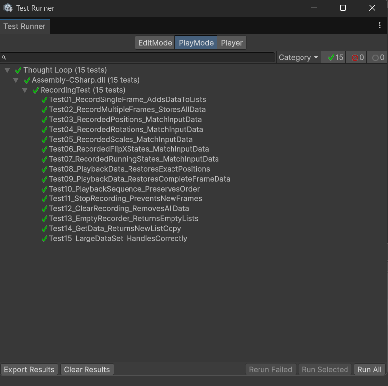

<div dir='rtl' lang='he'>

# לולאת המחשבה - Thought Loop 🔄

## 📖 תיאור המשחק
 
**לולאת המחשבה - Thought Loop** הוא משחק פאזל-פלטפורמר 2D שבו אתה הופך לשותף של עצמך.


בכל שלב יש לך 10 שניות לחקור את הסביבה. כשהזמן נגמר, שכפול שלך מופיע ומשחזר את כל התנועות שעשית - בדיוק אותו דבר. עכשיו אתה שולט בשתי דמויות: אתה בהווה והעתק שלך מהעבר.  
**אבל!** אם תיגע בשכפול שלך - הכל מתאפס מההתחלה.
---

**ז'אנר:** Puzzle Platformer, Time Manipulation   
**קהל יעד:** גילאי 12+, חובבי משחקי חשיבה כמו Portal, Braid, The Witness

---

קישור למשחק - https://chanan-hash.itch.io/thought-loop


## 🎮 כיצד לשחק

**בקרה:**
- **←/→ או A/D** - תנועה ימינה/שמאלה
- **רווח/↑ או W** - קפיצה

**מטרה:**
- השתמש בשכפול שלך כדי לפתור חידות
- לחץ על כפתורים במקביל
- פתח שערים שאי אפשר לפתוח לבד
- הגע לדגל בסוף השלב

---


# הסבר פתיחת המשחק

נתאר את **30 השניות הראשונות של המשחק** ואת מבנה ההתקדמות הראשוני בשלבים, לצד עקרונות עניין, היגיון עיצובי, בדיקות משחק ורכיבי המערכת.

---

## 🎬 סצנות 

1. **פתיח ראשי**
2. **סיפור רקע**  
   - כולל מעברי *Fade* אלגנטיים
3. **טוטוריאל 1** – תנועה בסיסית (חיצים + קפיצה)
4. **טוטוריאל 2** – הדגמה ראשונית של *מכניקת השכפול*
5. **שלב 1** – הרחבת הרעיון לכפתורים ותיאום בסיסי
6. **שלב 2** – קושי גבוה יותר, טעויות נפוצות, הוספת אויב שגורם לפסילות מהירות

---

## 🧠 1) הבנה – מה השחקן לומד?

- המשחק מתחיל בסיפור רקע קצר, ולאחריו שני שלבי הדרכה (Tutorial).
- **טוטוריאל 1**: מסביר שליטה בסיסית (תזוזה, קפיצה).
- **טוטוריאל 2**: מדגים את מנגנון השכפול בצורה פשוטה אך מסקרנת.
- כבר בשלב זה מוצג לשחקן כי אפשר לקחת את רעיון הזמן/השכפול *רחוק יותר*.
- שלבי המשחק הראשונים:
  - בונים על מה שנלמד בטוטוריאל.
  - דורשים תיאום בין שחקן לבין השכפול שלו.
- בכל שלב מופיעה **הודעת רמז לא ברורה במכוון**, כדי להכניס את השחקן לסקרנות ולגרום לו לחשוב על הפתרון.

---

## ⭐ 2) עניין – יצירת מעורבות אצל השחקן

- כשהשחקן מגיע לדגל הסיום:
  - מופיע **פופ־אפ של "כל הכבוד"**.
  - כפתור "המשך לשלב הבא".
  - בנוסף קיים כפתור **Reset** ברור.
- המשחק *בכוונה לא מסביר* על עניין הפסילה:
  - אין התראה "נכשלת".
  - השלב פשוט מתאפס מיד.
  - זה יוצר רגע של בלבול מתוכנן ↩ שמטרתו להעצים את תחושת האתגר.
- ככל שהשלבים מתקדמים (למשל שלב 2) –  יכול להיגרם יותר פסילות ולכן נוצרת למידה דינמית.
- בכל שלב מופיע רמז חצי־מסתורי:
  - לא תמיד באמת עוזר.
  - נותן תחושת עומק ומעודד חשיבה.

---

## ⚙️ 3) הסברים על רכיבי המשחק

- פרמטרים שהמשתמש (Level Designer) **כן אמור לשנות בעורך Unity** —  
  מוגדרים כ־`[SerializeField]`.
- פרמטרים שהם חלק פנימי מהלוגיקה של הרכיב ולא מיועדים לשינוי חיצוני —  
  מוגדרים כ־`private`.
- כך נשמר:
  - סדר וניקיון בקוד  
  - שליטה על מה ניתן לשנות ומה לא  
  - מניעת טעויות מצד העורך

---

## 🧪 4) בדיקות
בשלב זה כל האלמנטים במשחק ניתנים לבדיקה ויזואלית, גם מערכת ההקלטה והשכפול. ניתן לראות ולבדוק יחד עם המשחק את ההחזרה של השכפול על מיקום והאנימציות השחקן, יחד עם כל הדפסות הלוגים. 
- בכל זאת עשינו קובץ של בדיקות עבור **מערכת ההקלטה והשחזור**
- על מנת להריץ מתוך עורך Unity נלך:
 1. תפריט ראשי (בסרגל הכלים): `Window > General > Test Runner`
 2. נלחץ על חלון `PlayMode`
 3. נראה שם  ` RecordingTests (15 test)`
 נוכל ללחוץ על החיצים כדי לראות את הטסטים
 4. ואז נלחץ למטה על `Run All`

תוצאות הטסטים:  




[תיקיית הטסטים](./Assets/Test)

---

# 🎮 בדיקות משחק – Playtest

נגדיר מספר שאלות מרכזיות לשחקנים חדשים, על מנת להבין את איכות החוויה ואת רמת ההסבר:

---

### 1) האם הבנת את רעיון המשחק?
בדיקה האם שחקן חדש מבין *מהי מכניקת השכפול* ומהי המטרה – לא האם פתר מהר.

### 2) האם נהנית? האם היה מאתגר?
בדיקה האם המשחק מסקרן, מהנה ומחזיק עניין בשלבים הראשונים.  
נרצה ליצור רמת קושי מאוזנת – לא קלה מדי כדי לא לאבד עניין, ולא קשה מידי מה שגורם לשחקן לתיסכול.  

### 3) האם היית משנה משהו בשכפול או בצורה שבה הוא עובד?
- זמן ההופעה שלו (לא להיעצר אחרי 10 שניות, או האם עדיף לאחר 20 שניות או דווקא 5 שניות)
- במהירות שבה השכפול זז

### 4) איך ניתן להפוך ליותר מעניין, אילו רכיבים היית מוסיף או משנה?
- האם כדאי לשנות פסילות?
- האם להוסיף אויבים / איסוף פריטים / דירוג שלבים?

### 5) האם להרחיב את העולם?
האפשרויות:
- חדרים סגורים (כמו עכשיו) – הכל גלוי מההתחלה  
- עולם פתוח/חצי פתוח עם מצלמה עוקבת – החידה לא ברורה מיד  
נרצה להבין מה מעניין יותר.

### 6) האם הוספה של יותר שכפולים תשפר או תהרוס?
חשוב להבין האם עוד שכפולים:
- מגבירים אתגר  
- יוצרים כאוס  
- פוגעים בחוויית המשחק  
- או דווקא מעצימים את המכניקה

### 7) הצע רעיון לשלב חדש
רעיונות משחקנים חדשים חשובים לנו, שחקנים שמציעים שלבים מרגישים שהם חלק פעיל מהעיצוב, ולעיתים מציעים רעיונות מצוינים להרחבת המשחק.

---
## תיעוד של חלקי הקוד

### 1. מכניקת הקלטה ושחזור (Recording & Playback)

#### `RecorderManager.cs` – הקלטת תנועות השחקן  
- מתעד בכל פריים: מיקום (`positions`), סיבוב (`rotations`), גודל (`scales`), והיפוך ספרייט (`flipXStates`).
- מתעד מצבי אנימציה: `isRunning`, `isJumping`.
- פונקציה עיקרית (`Update`), בה מתווספים כל הנתונים למשל      
  `positions.Add(player.transform.position);`

    - פונקציות עזר:  
    - `StopRecording()` ‒ עוצר הקלטה  
    - `ClearRecording()` ‒ מאפס  
    - `GetPositions()`/`GetRotations()` וכו'

#### `ClonePlayback.cs` – שחזור מאקרו תנועות  
- מקבל את כל הרשימות מה־RecorderManager.
- משחזר מיקום/סיבוב/סקייל/אנימציה פריים-אחר-פריים למשל:  
 - למיקום:    
  `transform.position = positions[currentFrame];`
- לאנימצית ריצה:    
  `animator.SetBool("isRunning", isRunningStates[currentFrame]);`

  ---

### 2. מערכת ניהול השכפולים (Clone Management)

#### `CloneSpawner.cs` – יצירת שכפול  
- עוצר הקלטה  
`recorderManager.StopRecording();`
    - יוצר שכפול חדש ומתחיל השמעה מהנתונים:      
`playback.StartPlayback(positions, rotations, ...);`
    - מסמן את השכפול ב־ `tag = "Clone"`

#### `CloneTimer.cs` – טיימר ותצוגה  
- סופר לאחור, ומפעיל יצירת שכפול כשתם הזמן:  
```csharp
if (timer <= 0)
{
    cloneSpawner.SpawnClone();
}
```

---

### 3. מכניקות פאזל

#### `PressureButton.cs` – כפתור לחיץ  
- משתמש ב־Trigger לזיהוי דריכה ולהפעיל את האנימציה:  

    - פונקציית עזר: `IsPressed()`

#### `MovingWall.cs` – קיר נע  

מחזיק מערך של כפתורים וכשכולם לחוצים יעלה את הקיר (עוזר לעשות שלב מרובה כפתורים)    
`private bool AreAllButtonsPressed()`

---

### 4. מהלכי שלב

- התנגשות עם שכפול → אתחול סצנה (ראו `playerMovment.cs`)
- הגעה לדגל → VictoryPopup וטעינת שלב (ראו `Flag.cs`, `VictoryPopup.cs`)

---

### 5. ארכיטקטורה מודולרית

- כל מחלקה אחראית רק להתנהגות יחידה.
- ניתן לשלוף/להחליף רכיב בקלות.
- דוג', חתימות בולטות:
    - תנועה: `playerMovment.cs`
    - הקלטה: `RecorderManager.cs`
    - יצירת שכפול: `CloneSpawner.cs`
    - השמעה: `ClonePlayback.cs`
    - ספירה: `CloneTimer.cs`
    - כפתור/קיר/הגדרות פאזל: `PressureButton.cs`, `MovingWall.cs`, ...

---
## 🎨 נכסים (Assets)

- **Pixel Adventure 1** - ספרייטים לדמויות וסביבה

[רכיבים רשמיים](Formal_Elements/formal-elements.md)  


חברי הצוות: דוד שטרן וחנן הלמן
</div>
