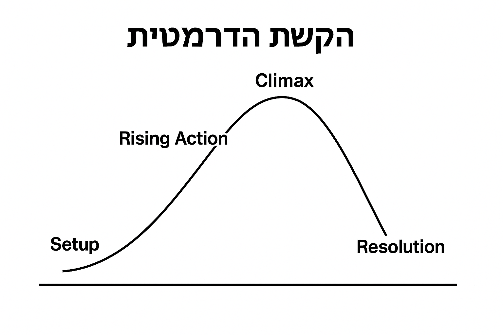

# רכיבים דרמטיים למשחק

## 1. אתגר

### כישורים נדרשים
- חשיבה קדימה ותכנון מהלכים.
- תיאום בין השחקן לשכפולים.
- שליטה בתזמון מדויק.
- זיכרון פעולות ותבניות תנועה.
- פתרון בעיות תחת מגבלת זמן.

דוגמה:
למשל שלב בו יש צורך בתיאום של כמה כפתורים (יותר מאחד) יחד עם אויב שגם לשכפול וגם לדמות אסור להתנגש בה, כלומר גם אם ברור מה צריך לעשות, התכנון והתזמון יותר מאתגר, וידרוש כישורים יותר חדים כשאר הכל תחת זמן.

### רמות קושי (בחירה בתחילת המשחק)
**קל**
- טיימר: 15 שניות.  
- מהירות השכפולים: איטית (0.8x).  
- רמזים חזותיים (Ghost Trail).  
- אין ענישה על ריסטרט.

**בינוני (ברירת מחדל)**
- טיימר: 10 שניות.  
- מהירות רגילה.  
- ללא רמזים.

**קשה**
- טיימר: 5 שניות.  
- מהירות השכפולים: מהירה (1.2x).  
- אויבים בתנועה בשלב.  
- ענישה על פסילות (איבוד ניקוד/נסיונות מוגבלים).

### התאמת קושי דינמית
- לאחר **3–4 פסילות**: הצעת רמז – “נסה ללחוץ קודם על הכפתור השמאלי”.  
- לאחר **השלמה מהירה** מהצפוי: פתיחת Hard Mode בשלב הבא.  
- אם הזמן שלוקח לשחקן גדול פי 2 מהצפוי → האטת השכפולים בכ־10%.

---

## 2. זרימה

### מיקוד תשומת לב
- הסרת UI מיותר בזמן המשחק (כלומר בחירת רקע מתאים שלא יתפוס את העין ויסיח דעת, כגון רקע צהוב).
- הארה (Spotlight) על כפתורים/אובייקטים חשובים.
- זום־אין קצר על אירועים קריטיים (למשל יצירת שכפול) או על השחקן עצמו, כלומר המצלמה עוקבת אחרי אזור השחקן.

### תחושת שליטה
- תגובתיות מלאה לתנועות.
- אפשרות לביטול פעולה לפני ספאון השכפול (Restart Record).
- הילוך איטי (0.5 שניות) בזמן הופעת שכפול חדש.
- תצוגת מקשים מינימלית אך ברורה.

### משוב לשחקן
- הודעת "כל הכבוד!" בהצלחה ו"נכשלת!" בפסילה.
- דירוג כוכבים לפי:
  - מהירות
  - מספר פסילות
  - איסוף פריטים
- אפקטים ויזואליים: קונפטי, סאונד מעבר שלב, סאונד פסילה.
- אופציונלי: כפתור להתחלת ההקלטהה לשכפול, כלומר לא אוטמטי אלא לפי מתי שהחשקן מחליט
---

## 3. שעשוע

### פעולות נחמדות שאינן קשורות ישירות למטרה
- אנימציות סרק (Idle).
- אופציונלי: "ריקוד שכפולים" – אם השחקן קופץ 5 פעמים ברצף או עומד במקום למשך כמה שניות מידי זמן.
- פריטים לאסוף (כוכבים/תפוחים) המשפיעים על ניקוד ובונוסים.
- אפשרות לפתוח סקינים עם כוכבים.

### סוגי שחקנים מתאימים
- **Achievers** – פתרון פאזלים.  
- **Explorers** – מציאת נתיבים סודיים (ניתן להוסיף).
- **Casual** – שליטה פשוטה ומכניקה ברורה + שבלים ורמות קושי מתאגרים יותר.  
- **Socializers** – הוספת Leaderboard או שליחת Replay.  
- **Killers** – מצב תחרות מול Ghost של חבר.

### הרחבה לסוגי שחקנים נוספים
- מסלולים סודיים.  
- מצב "אתגר יומי".  
- תחרות זמן מול שחקנים אחרים.

---

## 4. רגשות

### רגשות צפויים במהלך המשחק
- **בלבול** – הופעת השכפול הראשון.  
- **תסכול קל** – ניסיון לתזמן נכון.  
- **גילוי** – הבנה מה צריך לעשות לפתור.  
- **סיפוק** – כשהתיאום מצליח.  
- **גאווה** – סיום שלב קשה.

### איך העיצוב מחזק רגשות אלה
- עצירה קצרה בזמן הופעת השכפול הראשון + הסבר.  
- טיפים הומוריסטיים לאחר מספר כשלונות.  
- Slow-Mo בניצחון.  
- מוזיקה משתנה בהתאם להצלחה/כישלון.

---

## 5. סיפור רקע

נעיר כי זה יותר מכווון משחק פאזל פשוט ומהנה, כלומר פתירת חידות או חדרים, ולא בהכרח עם עלילה מאחורה, אך עלילה יכולה להוסיף בלי קשר לתת קצת עניין למשחק (גם אם זה משהו שהוא יותר מאחורי הקלעים לשלבים, כל כמה שלבים חופשים איזה משהו בסיפור). בדומה למשחק מובייל `Tricky Castle`, שבו כל חדר הוא פיתרון חידה אבל יש סיפור רקע מאחורה של אביר שמנסה להציל נכיסה ובכל חדר הוא מתקדם לעברה.

### רעיון עלילתי
מדען ממציא מכונת זמן, אך ניסוי משתבש והוא נתקע בלולאת זמן של 10 שניות.  
כל פעולה שהוא מבצע נשמרת ומופיעה שוב בתור שכפול.  
כדי לברוח מהמעבדה עליו לשתף פעולה עם העבר של עצמו.

### העברת הסיפור לשחקן
- סרטון פתיחה קצר (טקסט/תמונות).  
- רמזים ויזואליים במעבדה:  
  - מסכים שבורים  
  - מחברת ניסויים  
  - שלטים אזהרה (“Do Not Touch Your Temporal Clone”)  
- חפצי "זיכרון" שפזורים בשלבים (לוגים קצרים).

אופציה נוספת לעלילה: חייזר/רובוט שנופל מחליית לאיזה ארץ, ובגלל הנפילה קרתה תקלה שגורמת לשכפולים להיווצר, והוא מנסה להגיע לחללית אחרת כדי לחזור הביתה (אופן הבניה וההצגה יהיה דומה)

---

## 6. דמויות

### דמויות מרכזיות
- **הגיבור** – הרובוט.  
- **המתנגד** – "שיבוש זמן", כלב־שומר, או שכפול מרושע בשלבים מתקדמים.

### דמויות משניות
- המדריך – הודעות טקסט/AI שנותן רמזים.  
- דמויות תקועות נוספות (אופציונלי).  
- אויבים: כלבים, רובוטים, חיישני זמן, כמו לייזרים.

### שינויי דמויות במשחק
- הופעת שכפולים נוספים.  
- שינוי מהירות/התנהגות באויבים או בשכפולים כדי להתאים רמת קושי.  

### "רצון חופשי"
- אויבים זזים בתבניות יחסית קבועות (הלילכה קדימה אחרוה או קפיצה מעל מכשול כמו קירו או קופסה), הקושי קורה בתיאום של הרובוט/שחקן ראשי יחד עם השכפול או שכפולים.  
- מדריך שמגיב לפעולות השחקן (למשל אחרי כמה פסילות הודעת עזרה, או הודעה משעשעת של תמיכה).  
נעיר: כי אין תכנון לרצון חופשי מידי, למעט השחקן הראשי שבוחר את הפעולות שלו, בסוף מדובר על משחק פאזל של פתירחת חידות של החדר.
---

## 7. עלילה
העלילה מתוכננת כמשהו לינארי/חצי פרבולי, כלומר קצת גדילה אבל לא באופן חד. ככל שמתקדמים בשלבים הם נהיים יותר מתוחכמים ומאתגרים (זה יכול להיות בכל מיני צורות תלוי שלב, למשל: בכמות השכפולים או במהירות שלהם, במורכבות השלב כמו האם יש כמה קומות, כמות אויביים, כמות תיאום בכפתורים ,זמן השכפול שנוצר)

נניח 3/4 שלבים ראשוניים יותר פשוטים בדרישה של התיאום ושל כמות השכפולים או מורכבות הפאזל, ובערך כל 3 שלבים להעלות את הרמה

### הקשת הדרמטית
- **Setup:** לימוד מכניקת השכפול.  
- **Rising Action:** יותר קומות, יותר אויבים, יותר שכפולים.  
- **Climax:** שלב סופי עם 3+ שכפולים בו זמנית.  
- **Resolution:** בריחה מהמעבדה/Loop.

### השפעת השחקן על העלילה
- ככל שהשחקן פותר ומתקדם בשלבים הם נהיים מתאגרים יותר, כלומר השפעה ישירה.
  
- אופציונלי: השפעה על חשיפה בסיפור או בסיום שלו
 - איסוף כל הפריטים → סוף "אמיתי".  
 - פתרון מהיר → סוף "מושלם".  
 - דילוג על שלבים → סוף מקוצר.

---

## 8. בניית עולם

### חוקי טבע 
- לולאה של 10 שניות.  
- מגע בשכפול גורר Reset.  
- אפשרות להעלמת שכפולים ישנים (X לולאות).
- הליכה וקפציה רגילים
  
### גיאוגרפיה
- שלבים בארץ/אדמה/יער, שניתן לקפוץ ולעמוד עליהם, יכול להיות בכמה קומות או שלבים (שלב כמו אדמה עומדת באוויר שניתן לקות עליה)
- אפשרות לפי בחירת עלילה, למשל מעבדה עתידנית, בהמשך המעבדה "מתפרקת" – סדקים, ניצוצות. בשלבים מאוחרים "אזור מקולקל" עם גליצ'ים ויזואליים.
- 
### כלכלה
- איסוף פריטים (כוכבים/תפוחים) לרכישת סקינים ופתיחת שלבים.

### איך השחקן לומד את העולם?
- שלבי Tutorial.  
- שילוט, מסכים.  
- רמזים ויזואליים המופיעים באמצע המשחק.

