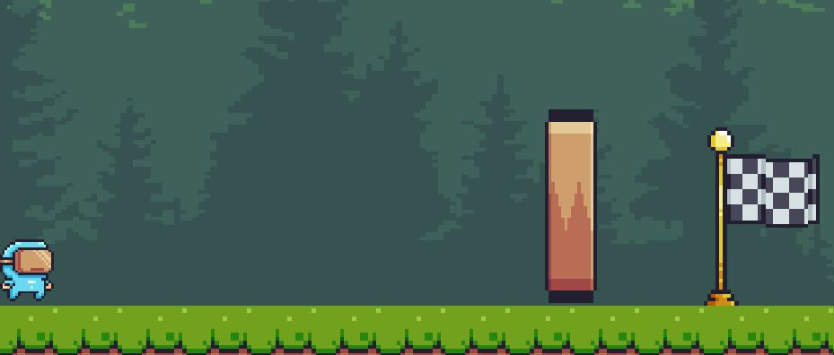

# תכנון רכיבים דינאמיים במשחק

## 1. מאפיינים עיקריים של העצמים במשחק

### רכיבים דינאמיים
הרכיבים הדינאמיים המרכזיים במשחק הם:

- **השחקן** – תנועה וקפיצה.
- **מערכת ההקלטה והשכפול** – קיימות שתי מערכות:
  - מערכת ליצירת שכפול יחיד.
  - מערכת ליצירת מספר שכפולים.
  
  על אף הדמיון בין המערכות, בחרנו להפריד ביניהן מטעמי נוחות וחלוקת אחריות. המערכת לשכפול יחיד פשוטה יותר, נוחה לבדיקה ומתאימה לשלבים בסיסיים, בעוד שהמערכת המורחבת מיועדת לשלבים מורכבים הדורשים תיאום בין מספר שכפולים.
- **זמן השכפולים** – ברירת המחדל היא 10 שניות. זהו זמן שמאפשר לשחקן גם להבין את השלב וגם לפתור אותו, אך אינו ארוך מדי. בשלבים מאתגרים יותר הזמן מתקצר.
- **קיר נע** – נע כלפי מעלה במהירות משתנה, ניתן לבחור את כמות הכפתורים שתגרום לו להיפתח (וגם איזה כפתורים).
- **דגל + כפתור** – מאפשרים מעבר לשלב הבא.
- **אויב** – נע במהירות קבועה ומחליף כיוון בעת התנגשות.

### קביעת המאפיינים המספריים
קביעת הערכים בוצעה בשיטת **ניסוי וטעייה**: התחלנו מערכים נמוכים והעלינו אותם בהדרגה עד להגעה לאיזון נוח למשחק.

- **שחקן** – מהירות שאינה איטית מדי אך גם לא מהירה מדי.
- **אויב** – מהירות מאתגרת, אך כזו שעדיין איטית יותר ממהירות השחקן.
- **קיר** – המהירות והגובה משתנים לפי השלב.  
  בשלבים פשוטים נוצר פתח קטן בלבד, ואילו בשלבים הדורשים תיאום מורכב העלינו את המהירות והגובה, כך שהשחקן צריך גם ללחוץ על כפתור וגם להספיק לעבור את הקיר בזמן.

בכל סצנה בוצעו מספר ניסיונות משחק על מנת לבדוק את נוחות הפתרון, דבר שסייע רבות בבחירת הערכים הסופיים.

#### ערכים התחלתיים:
- **שחקן** – מהירות: 5, כוח קפיצה: 10  
- **קיר**:
  - שלבים פשוטים: גובה מקסימלי 3, מהירות 5  
  - שלבים מורכבים: גובה 8, מהירות 4  
- **אויב** – מהירות 3 (איטית יותר מהשחקן)  
- **טיימר שכפולים** – ברירת מחדל 10 שניות, ובשלבים מאתגרים 5 שניות

---

## 2. מיקומים של החפצים העיקריים במשחק

### רכיבים מרכזיים
הרכיבים הקבועים ברוב השלבים:
- אדמה
- שחקן
- קיר
- דגל

האדמה ממוקמת בתחתית המסך.  
השחקן מתחיל בצד שמאל של המסך, בעוד שהקיר והדגל נמצאים בצד ימין.  
מבנה זה מבוסס על מוסכמה מוכרת במשחקי פלטפורמה – תנועה משמאל לימין עד לסיום השלב.

שאר הרכיבים (כפתורים, קומות ואויבים) משתנים בהתאם לדרישות השלב.

כבור דוגמה למפה נביא קטע מתוך שלב שמייצג את התמונה הכללית של מבנה השלבים 

---

