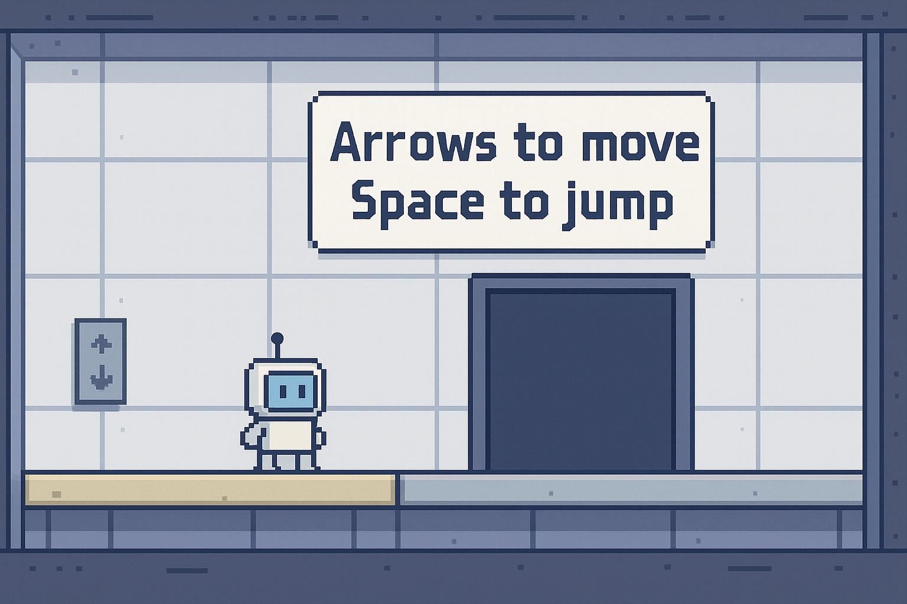
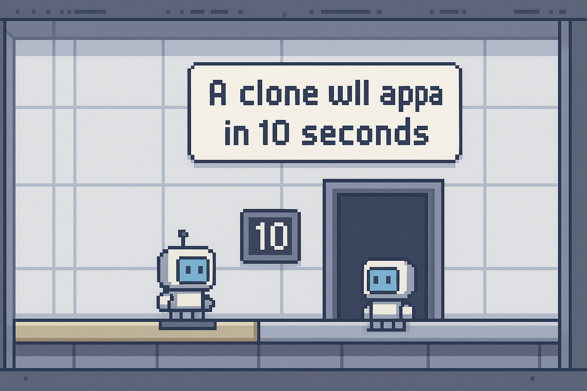
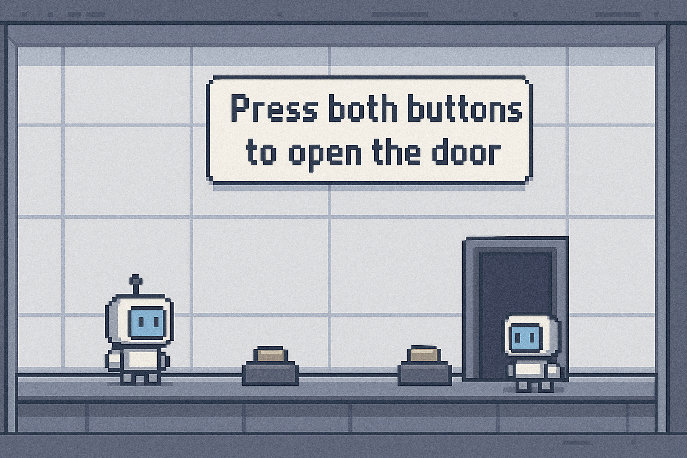
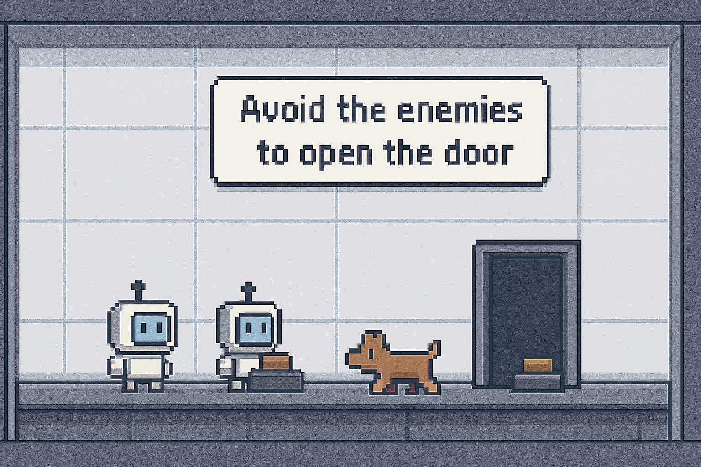
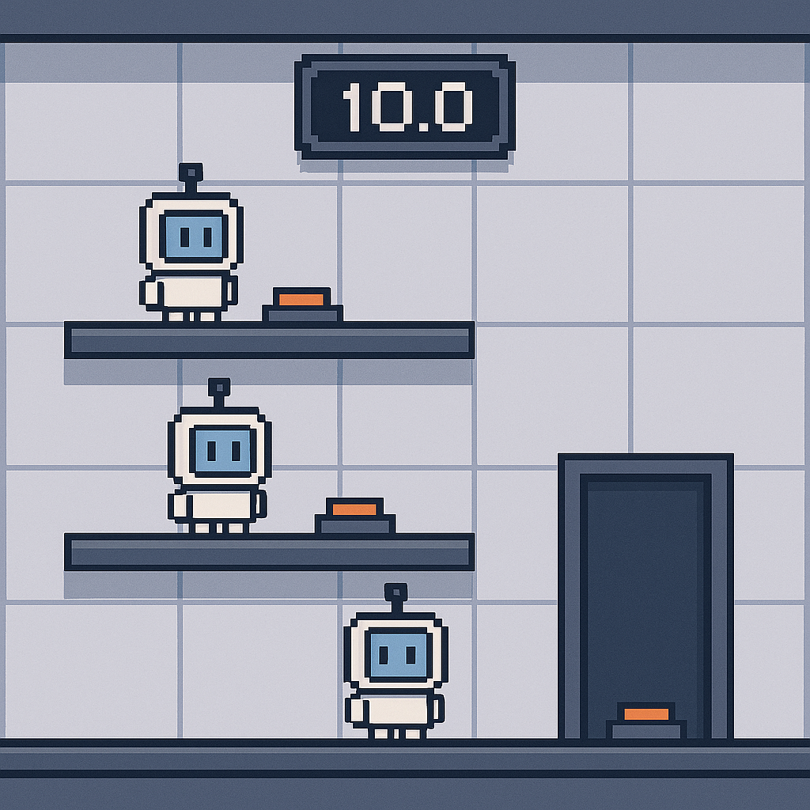
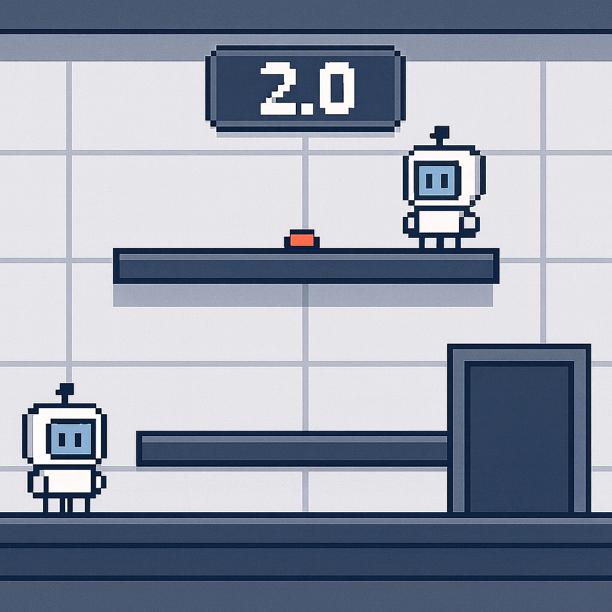

<h1 align="right"> Level Design – Thought Loop (Time-Clone Puzzle Platformer)
</h1>

מסמך זה מתאר את תכנון הרמות עבור המשחק, ברמת פירוט מספקת כך שמפתח יוכל לבנות את הרמות בפועל.  
המשחק מבוסס על תיאום בין השחקן לבין השכפולים (Clones) שמופיעים לאחר פרק זמן קבוע.
תיאור מפורט יותר של המשחק ניתן למצוא ב -
[רכיבים רשמיים (Formal Elements)](../Formal_Elements/formal-elements.md)

 **הערה**: התמונות שיובאו הן להמחשה בלבד כיצד השלב אמור להיראות, מה שעוזר להבין כיצד נראה השלב ומה הדרישה
---

## 🟦 שלב 0 – Tutorial (תנועה וקפיצה)

**מטרה:** ללמד שליטה בסיסית.  

**תיאור החדר:**  
- חדר ישר ופשוט.  
- דלת יציאה בקצה השני.  
- אין שכפולים או לולאות.  

**נדרש מהשחקן:**  
- ללכת ימינה.  
- לקפוץ על פלטפורמה אחת.  
- להגיע לדלת.

**הודעה על המסך:**  
חיצים לתנועה — רווח לקפיצה

תמונה להמחשה:

---

## 🟦 שלב 0.2 – Tutorial (היכרות עם שכפול)

**תיאור החדר:**  
- חדר פשוט עם דלת בסוף.
- כפתור יחסית בתחילת החדר 
- בתחילת הרמה מוצגת הודעה המסבירה את מערכת השכפול.  
- מופיע טיימר של 10 שניות.  

**מנגנון הרמה:**  
- לאחר 10 שניות מופיע השכפול שמבצע מחדש את פעולות השחקן.  
- יש כפתור שעל השחקן לעמוד עליו כדי לפתוח את הדלת.  
- המרחק בין הכפתור לדלת קצר מדי כדי להספיק ללחוץ ולרוץ בזמן — מה שמכריח שימוש בשכפול הראשון לתיאום.

תמונה להמחשה:

---

## 🟦 שלב 1 – תיאום בסיסי בין שחקן לשכפול

**תיאור החדר:**  
- חדר פשוט בצורת קו ישר.  
- שני כפתורים: אחד בתחילת החדר, אחד בסופו.  
- הדלת תיפתח רק כאשר שני הכפתורים לחוצים בו-זמנית.

**אתגר:**  
- תכנון הזמן כך שהשכפול יישאר על כפתור אחד בזמן שהשחקן מגיע לכפתור השני.

תמונה להמחשה:

---

## 🟦 שלב 2 – תיאום תחת סכנה (אויבים)

**תיאור החדר:**  
- כמו שלב 1 (קו ישר, שני כפתורים).  
- נוסף אויב אחד לפחות (כלב/דמות אחרת) שהולך הלוך ושוב.  

**חוק:**  
- אסור לשחקן **וגם לשכפול** לגעת באויב.  

**אתגר:**  
- תיאום זמן מדויק יותר:  
  - גם ללחוץ על שני הכפתורים.  
  - גם לתזמן מעבר מול אויב זז.

תמונה להמחשה:

---

## 🟦 שלב 3 – שלוש קומות, 2 שכפולים

**תיאור החדר:**  
- חדר בעל **3 קומות**.  
- הדלת נמצאת בקומה התחתונה, בצד ימין.  
- יש **כפתור בכל קומה**.  
- נוצרים **2 שכפולים** במהלך הרמה.

**אתגר:**  
- יש לתזמן שלוש לחיצות בו-זמנית:  
  1. השכפול הראשון  
  2. השכפול השני  
  3. השחקן עצמו  
- תוך שמירה על כך שאף דמות לא תיגע בשנייה.

תמונה להמחשה:

---

## 🟦 שלב 4 – קיצור זמן השכפול + רדיפה אנכית

**שינוי משמעותי:**  
- זמן השכפול מתקצר משמעותית (למשל ל־2 שניות במקום 10).

**תיאור החדר:**  
- חדר בסגנון של שלב 3 (מספר קומות).  
- כפתור אחד בקומה העליונה – בפינה הימנית.

**אתגר:**  
- המחזור הופך למרוץ מהיר למעלה לפני שהשכפול יגיע.  
- סיכון מוגבר להתנגשות עם השכפול, מה שמוביל לפסילה.

**אפשרות הרחבה:**  
- יצירת **שני שכפולים** בהפרש של 2 שניות — מוסיף שכבת קושי נוספת.

תמונה להמחשה:

